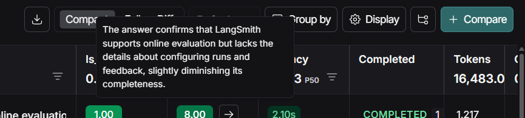
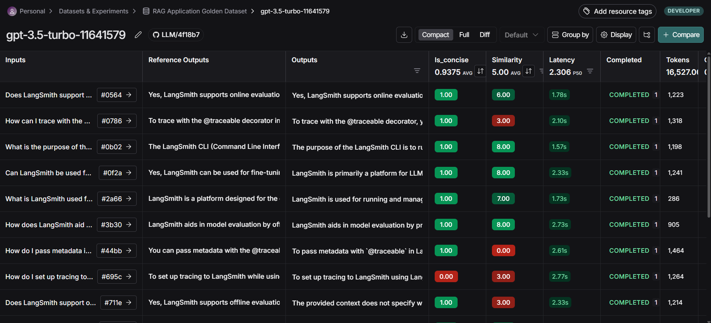

# Kush-Sahni-2210110371-MAT495-Monsoon2025  langsmith

This is the overall summary of what I have learned throught these 2 modules of Langsmith, 
please see my commit "comment" history for videowise learnings and changes in my notebooks
I have also included Screenshots of the Langsmith Dashboard as well to track what I have done alongside (Tracings, Dataset, Evalutor creation, Experiments)

## Module 1: Tracing and Monitoring

### Video 1 — Tracing Basics

**Learnings:**
- Learned how to implement fundamental tracing in LangChain applications
- Understood the importance of metadata in organizing and identifying runs in LangSmith
- Practiced setting up environment variables for tracing configuration
- Gained insights into monitoring model questions and tracking performance

**Code Changes:**
- Implemented environment variable configuration for tracing
- Added traceable decorators with metadata
- Created test cases for validation

**Notebooks:**
- My Implementation: [tracing_basics.ipynb](https://github.com/MAT496-Monsoon2025-SNU/Kush-Sahni-2210110371-MAT495-Monsoon2025/blob/main/intro-to-langsmith-my-version/notebooks/module_1/tracing_basics.ipynb)
- Original Tutorial: [tracing_basics.ipynb](https://github.com/MAT496-Monsoon2025-SNU/Kush-Sahni-2210110371-MAT496-Monsoon2025-langsmith/blob/main/intro-to-langsmith-original/notebooks/module_1/tracing_basics.ipynb)

### Video 2 — Types of Run

**Learnings:**
- Mastered different run types and their specific uses
- Understood how run types help in organizing and analyzing model outputs
- Learned to use run types for better debugging and workflow transparency
- Implemented clear separation between different components in the pipeline

**Code Changes:**
- Added run type annotations to different functions
- Implemented proper tracing configuration
- Created test cases with different run types

**Notebooks:**
- My Implementation: [types_of_runs.ipynb](https://github.com/MAT496-Monsoon2025-SNU/Kush-Sahni-2210110371-MAT496-Monsoon2025-langsmith/blob/main/intro-to-langsmith-my-version/notebooks/module_1/types_of_runs.ipynb)
- Original Tutorial: [types_of_runs.ipynb](https://github.com/MAT496-Monsoon2025-SNU/Kush-Sahni-2210110371-MAT496-Monsoon2025-langsmith/blob/main/intro-to-langsmith-original/notebooks/module_1/types_of_runs.ipynb)

### Video 3 — Alternative Tracing Methods

**Learnings:**
- Explored different methods of implementing tracing
- Learned about fine-grained control using trace() method
- Understood global vs. specific tracing approaches
- Studied various tracing configuration patterns

**Code Changes:**
- Implemented alternative tracing methods
- Added fine-grained tracing controls
- Created comparison test cases

**Notebooks:**
- My Implementation: [alternative_tracing_methods.ipynb](https://github.com/MAT496-Monsoon2025-SNU/Kush-Sahni-2210110371-MAT496-Monsoon2025-langsmith/blob/main/intro-to-langsmith-my-version/notebooks/module_1/alternative_tracing_methods.ipynb)
- Original Tutorial: [alternative_tracing_methods.ipynb](https://github.com/MAT496-Monsoon2025-SNU/Kush-Sahni-2210110371-MAT496-Monsoon2025-langsmith/blob/main/intro-to-langsmith-original/notebooks/module_1/alternative_tracing_methods.ipynb)

### Video 4 — Conversational Thread

**Learnings:**
- Mastered the implementation of conversation threading
- Learned to use metadata for linking related interactions
- Understood how to maintain conversation context
- Explored visualization of conversation flows in LangSmith

**Code Changes:**
- Implemented conversation thread management
- Added metadata for thread tracking
- Created multi-turn conversation examples

**Notebooks:**
- My Implementation: [conversational_threads.ipynb](https://github.com/MAT496-Monsoon2025-SNU/Kush-Sahni-2210110371-MAT496-Monsoon2025-langsmith/blob/main/intro-to-langsmith-my-version/notebooks/module_1/conversational_threads.ipynb)
- Original Tutorial: [conversational_threads.ipynb](https://github.com/MAT496-Monsoon2025-SNU/Kush-Sahni-2210110371-MAT496-Monsoon2025-langsmith/blob/main/intro-to-langsmith-original/notebooks/module_1/conversational_threads.ipynb)

## Module 2: Experiments and Evaluation

### Video 1 — Datasets

**Learnings:**
- Understood the concept of golden datasets in LangSmith
- Learned different methods of creating and managing datasets
- Explored various ways to add examples to datasets
- Mastered dataset versioning and management

Adding input output pair example to my dataset for Testing 

Created 5 synthetic AI generated examples after creating input output schema in the Dataset

**Code Changes:**
- Implemented dataset creation and management
- Added various types of examples
- Created validation test cases

**Notebooks:**
- My Implementation: [dataset_upload.ipynb](https://github.com/MAT496-Monsoon2025-SNU/Kush-Sahni-2210110371-MAT496-Monsoon2025-langsmith/blob/main/intro-to-langsmith-my-version/notebooks/module_2/dataset_upload.ipynb)
- Original Tutorial: [dataset_upload.ipynb](https://github.com/MAT496-Monsoon2025-SNU/Kush-Sahni-2210110371-MAT496-Monsoon2025-langsmith/blob/main/intro-to-langsmith-original/notebooks/module_2/dataset_upload.ipynb)

### Video 2 — Evaluators

**Learnings:**
- Mastered different types of evaluators in LangSmith
- Understood metrics for model output evaluation
- Learned to implement custom evaluators
- Explored LLM-as-judge evaluation patterns

**Code Changes:**
- Created custom evaluator implementations
- Added comparative evaluation cases
- Implemented scoring mechanisms

**Notebooks:**
- My Implementation: [evaluators.ipynb](https://github.com/MAT496-Monsoon2025-SNU/Kush-Sahni-2210110371-MAT496-Monsoon2025-langsmith/blob/main/intro-to-langsmith-my-version/notebooks/module_2/evaluators.ipynb)
- Original Tutorial: [evaluators.ipynb](https://github.com/MAT496-Monsoon2025-SNU/Kush-Sahni-2210110371-MAT496-Monsoon2025-langsmith/blob/main/intro-to-langsmith-original/notebooks/module_2/evaluators.ipynb)

### Video 3 — Experiments

gpt-4o evaluation experiment

gpt-3.5-turbo Evaluation Experiment 

2 Repetitions Run on my is_concise_enough evaluator

**Learnings:**
- Understood the structure and purpose of LangSmith experiments
- Learned to run experiments on different dataset segments
- Mastered experiment configuration and execution
- Explored detailed performance analysis

**Code Changes:**
- Implemented various experiment configurations
- Added specific example testing
- Created performance measurement cases

**Notebooks:**
- My Implementation: [experiments.ipynb](https://github.com/MAT496-Monsoon2025-SNU/Kush-Sahni-2210110371-MAT496-Monsoon2025-langsmith/blob/main/intro-to-langsmith-my-version/notebooks/module_2/experiments.ipynb)
- Original Tutorial: [experiments.ipynb](https://github.com/MAT496-Monsoon2025-SNU/Kush-Sahni-2210110371-MAT496-Monsoon2025-langsmith/blob/main/intro-to-langsmith-original/notebooks/module_2/experiments.ipynb)

### Video 4 — Analyzing Experiment Results

**Learnings:**
- Mastered result analysis in LangSmith
- Learned to compare different model performances
- Understood performance metrics interpretation
- Explored dashboard analytics

Total 9 Experiments

My dataset public link: https://smith.langchain.com/public/a3b2ea5e-a61d-463b-a81c-68f54e69b39c/d

**Code Changes:**
- Focus was on result analysis and interpretation
- No code changes required

### Video 5 — Pairwise Experiments

**Learnings:**
- Understood pairwise comparison methodology
- Learned to implement LLM-as-judge evaluations
- Mastered direct output comparison techniques
- Explored prompt optimization strategies

**Code Changes:**
- Implemented pairwise comparison logic
- Modified evaluation prompts
- Created comparison test cases

**Notebooks:**
- My Implementation: [pairwise_experiments.ipynb](https://github.com/MAT496-Monsoon2025-SNU/Kush-Sahni-2210110371-MAT496-Monsoon2025-langsmith/blob/main/intro-to-langsmith-my-version/notebooks/module_2/pairwise_experiments.ipynb)
- Original Tutorial: [pairwise_experiments.ipynb](https://github.com/MAT496-Monsoon2025-SNU/Kush-Sahni-2210110371-MAT496-Monsoon2025-langsmith/blob/main/intro-to-langsmith-original/notebooks/module_2/pairwise_experiments.ipynb)

### Video 6 — Summary Evaluators

**Learnings:**
- Understood aggregate evaluation methods
- Learned to implement summary metrics
- Mastered global performance analysis
- Explored statistical evaluation techniques

Comparison of our model output and Referenced datased gold standard output

Here as you can see have got a good enough F1 Score of 0.86 for the model:

**Code Changes:**
- Implemented summary evaluation logic
- Added aggregation mechanisms
- Created statistical analysis cases

**Notebooks:**
- My Implementation: [summary_evaluators.ipynb](https://github.com/MAT496-Monsoon2025-SNU/Kush-Sahni-2210110371-MAT496-Monsoon2025-langsmith/blob/main/intro-to-langsmith-my-version/notebooks/module_2/summary_evaluators.ipynb)
- Original Tutorial: [summary_evaluators.ipynb](https://github.com/MAT496-Monsoon2025-SNU/Kush-Sahni-2210110371-MAT496-Monsoon2025-langsmith/blob/main/intro-to-langsmith-original/notebooks/module_2/summary_evaluators.ipynb)

## Repository Link
[Kush-Sahni-2210110371-MAT495-Monsoon2025](https://github.com/MAT496-Monsoon2025-SNU/Kush-Sahni-2210110371-MAT495-Monsoon2025)

This directory contains Jupyter notebooks that demonstrate various features and capabilities of LangSmith, organized by modules.

## Module 0: RAG Application
Location: `/notebooks/module_0/`

### RAG Application (rag_application.ipynb)
- Basic implementation of a Retrieval-Augmented Generation (RAG) system
- Uses LangSmith for tracing and monitoring
- Demonstrates vector store integration for document retrieval

## Module 1: Tracing and Monitoring
Location: [`Module 1`](https://github.com/MAT496-Monsoon2025-SNU/Kush-Sahni-2210110371-MAT496-Monsoon2025-langsmith/tree/main/intro-to-langsmith-my-version/notebooks/module_1)

### 1. Tracing Basics (tracing_basics.ipynb)
- Introduction to LangSmith tracing functionality
- Implementation of tracing decorators
- Demonstration of monitoring LLM calls and chain executions
- Setting up environment variables for LangSmith integration

### 2. Alternative Tracing Methods (alternative_tracing_methods.ipynb)
- Different approaches to implement tracing in LangChain applications
- Various tracing patterns and best practices
- Usage of different tracing decorators and their effects

### 3. Types of Runs (types_of_runs.ipynb)
- Understanding different types of runs in LangSmith
- Chain runs vs LLM runs
- Monitoring and analyzing different run types

### 4. Conversational Threads (conversational_threads.ipynb)
- Implementation of conversation tracking
- Managing conversation history
- Tracing conversational flows

## Module 2: Experiments and Evaluation
Location: [`Module 2`](https://github.com/MAT496-Monsoon2025-SNU/Kush-Sahni-2210110371-MAT496-Monsoon2025-langsmith/tree/main/intro-to-langsmith-my-version/notebooks/module_2)

### 1. Experiments (experiments.ipynb)
Key Features Implemented:
- Model comparison experiments between GPT-4 and GPT-3.5-turbo
- Custom evaluator implementation (`is_concise_enough`)
- Dataset versioning and management
- Different experiment configurations:
  - Multiple model evaluations
  - Dataset version comparisons
  - Split-based testing
  - Specific data point testing
  - Experiment repetitions
  - Concurrent execution
  - Metadata tagging

### 2. Dataset Upload (dataset_upload.ipynb)
- Process for creating and managing datasets in LangSmith
- Data versioning capabilities
- Dataset tagging and organization

### 3. Evaluators (evaluators.ipynb)
- Implementation of custom evaluation metrics
- Integration of evaluation frameworks
- Measuring model performance

### 4. Summary Evaluators (summary_evaluators.ipynb)
- Specialized evaluators for summary generation
- Metrics for measuring summary quality

### 5. Pairwise Experiments (pairwise_experiments.ipynb)
- Comparative analysis between different models
- Head-to-head performance testing

## Key Features Across Notebooks

### Environment Setup
- Configuration of API keys
- Setting up LangSmith environment variables
- Integration with various LLM providers

### Tracing Implementation
- Decorator-based tracing
- Automated monitoring of LLM calls
- Chain execution tracking

### Evaluation Framework
- Custom evaluation metrics
- Performance comparison tools
- Dataset management and versioning

### Experimentation
- Model comparison capabilities
- A/B testing frameworks
- Concurrent execution support

## Usage Notes
1. Ensure all environment variables are properly set in `.env` file
2. Each notebook can be run independently
3. Some notebooks may require specific API keys or access tokens
4. Follow the module order for best learning experience

## Dependencies
- LangChain
- LangSmith
- OpenAI
- Other requirements as listed in `requirements.txt`

