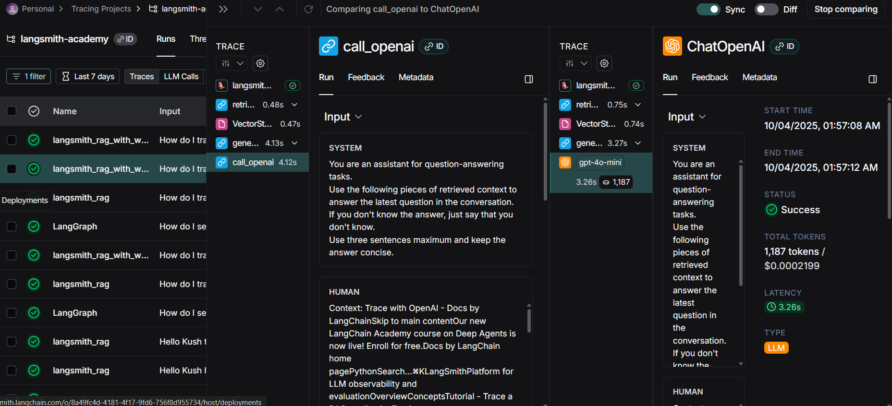
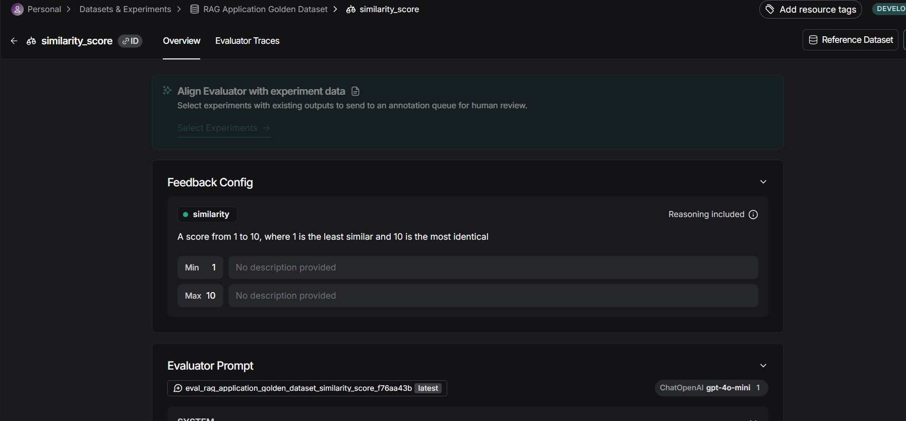
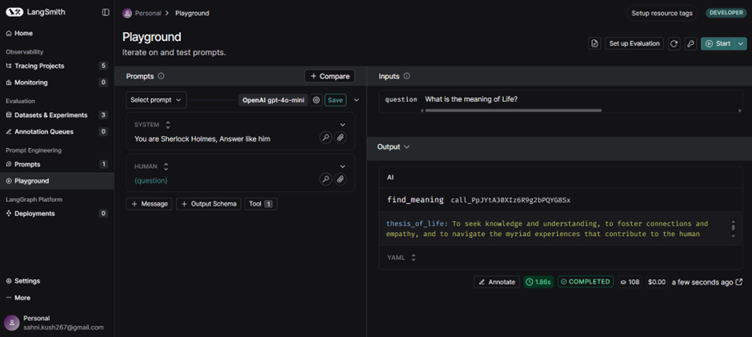

# Kush-Sahni-2210110371-MAT495-Monsoon2025  langsmith

This is the overall summary of what I have learned throught these 2 modules of Langsmith, 
please see my commit "comment" history for videowise learnings and changes in my notebooks
I have also included Screenshots of the Langsmith Dashboard as well to track what I have done alongside (Tracings, Dataset, Evalutor creation, Experiments)

## Module 1: Tracing and Monitoring

### Video 1 — Tracing Basics

**Learnings:**
I learned that the @traceable decorator keeps track of what each function does when it runs. It creates a tree that shows how functions are connected and what inputs they get. This information is sent to LangSmith so you can see it clearly. It runs in the background, so it doesn’t slow down the app. This makes it easier to find and understand where errors come from.

**Tasks I did:**
I added the @traceable decorator to each function and saw their run tree in the LangSmith dashboard and added Metadata some attributes to all the functions which I could then see on LangSmith Metadata tab of the trace

**Notebooks:**
- My Implementation: [tracing_basics.ipynb](https://github.com/MAT496-Monsoon2025-SNU/Kush-Sahni-2210110371-MAT495-Monsoon2025/blob/main/intro-to-langsmith-my-version/notebooks/module_1/tracing_basics.ipynb)
- Original Tutorial: [tracing_basics.ipynb](https://github.com/MAT496-Monsoon2025-SNU/Kush-Sahni-2210110371-MAT496-Monsoon2025-langsmith/blob/main/intro-to-langsmith-original/notebooks/module_1/tracing_basics.ipynb)

### Video 2 — Types of Run

**Learnings:**
I learned about the different types of runs that can be used with the @traceable decorator. These include:
•	LLM: Runs that call a language model.
•	Retriever: Runs that get documents from databases or other sources.
•	Tool: Runs that perform actions using function calls.
•	Chain: The default type; it links multiple runs together into a bigger process.
•	Prompt: Runs that prepare a prompt to use with an LLM.
•	Parser: Runs that extract structured data from responses.
You can set the type of run in the @traceable decorator based on what the function does.
**Tasks I did:**
specified what type of run in @traceble deorator
Used a run in the last using LangChain or OpenAI wrapper
Added Metadata attributes in some functions
ls_provider: The provider of model, For ex "openai", "anthropic"..
ls_model_name: name of the model, for ex "gpt-4o-mini"

**Code Changes:**
- Added run type annotations to different functions
- Implemented proper tracing configuration
- Created test cases with different run types

**Notebooks:**
- My Implementation: [types_of_runs.ipynb](https://github.com/MAT496-Monsoon2025-SNU/Kush-Sahni-2210110371-MAT496-Monsoon2025-langsmith/blob/main/intro-to-langsmith-my-version/notebooks/module_1/types_of_runs.ipynb)
- Original Tutorial: [types_of_runs.ipynb](https://github.com/MAT496-Monsoon2025-SNU/Kush-Sahni-2210110371-MAT496-Monsoon2025-langsmith/blob/main/intro-to-langsmith-original/notebooks/module_1/types_of_runs.ipynb)

### Video 3 — Alternative Tracing Methods

**Learnings:**
I learned about different ways to set up tracing in LangSmith:
•	@traceable: The main way to add tracing. It automatically handles the RunTree, inputs, and outputs for your functions.
•	LangChain/LangGraph: Gives tracing support by default, so you get traces without extra setup.
•	with trace(): Useful when you want more control over what inputs and outputs get logged. This is used when you’re not tracing a specific function (so you can’t use a decorator).
•	wrap_openai(): Used when working directly with the OpenAI SDK and you still want to capture traces.
•	RunTree: Used for low-level control over tracing setup, like when you need to manage run_id or connect tracing to another service.

**Tasks I did:**
Implemented a small version of LangGraph
Set LANGSMITH_TRACING=true
Learnt Alternative Approaches to Tracing: @Traceable (default method), LangGraph, trace(), wrap_openai, done implementation in notebook

**Notebooks:**
- My Implementation: [alternative_tracing_methods.ipynb](https://github.com/MAT496-Monsoon2025-SNU/Kush-Sahni-2210110371-MAT496-Monsoon2025-langsmith/blob/main/intro-to-langsmith-my-version/notebooks/module_1/alternative_tracing_methods.ipynb)
- Original Tutorial: [alternative_tracing_methods.ipynb](https://github.com/MAT496-Monsoon2025-SNU/Kush-Sahni-2210110371-MAT496-Monsoon2025-langsmith/blob/main/intro-to-langsmith-original/notebooks/module_1/alternative_tracing_methods.ipynb)

### Video 4 — Conversational Thread

**Learnings:**

I learned that many LLM applications use a chatbot-like interface where the user and the model have conversations.. To keep track of these ongoing conversations, LangSmith provides a Threads feature. It helps organize and monitor each conversation across multiple turns, making it easier to follow the flow and context of the chats we have..

**Tasks I did:** 
experimented with maintaining persistent conversational state using a fixed thread_id, LangSmith can support memory-like behaviors for applications such as chatbots

**Notebooks:**
- My Implementation: [conversational_threads.ipynb](https://github.com/MAT496-Monsoon2025-SNU/Kush-Sahni-2210110371-MAT496-Monsoon2025-langsmith/blob/main/intro-to-langsmith-my-version/notebooks/module_1/conversational_threads.ipynb)
- Original Tutorial: [conversational_threads.ipynb](https://github.com/MAT496-Monsoon2025-SNU/Kush-Sahni-2210110371-MAT496-Monsoon2025-langsmith/blob/main/intro-to-langsmith-original/notebooks/module_1/conversational_threads.ipynb)

## Module 2: Experiments and Evaluation

### Video 1 — Datasets

**Learnings:**
Learnt that in the LangSmith UI, you can also create and edit datasets with the LangSmith SDK, also about different features they have – like their inbuilt AI and manual way to add dataset examples 

**Tasks I did:**

I built custom datasets to serve as structured inputs for model evaluation, created five synthetic examples using built in AI feature in Langsmith

Adding input output pair example to my dataset for Testing 

Created 5 synthetic AI generated examples after creating input output schema in the Dataset

**Notebooks:**
- My Implementation: [dataset_upload.ipynb](https://github.com/MAT496-Monsoon2025-SNU/Kush-Sahni-2210110371-MAT496-Monsoon2025-langsmith/blob/main/intro-to-langsmith-my-version/notebooks/module_2/dataset_upload.ipynb)
- Original Tutorial: [dataset_upload.ipynb](https://github.com/MAT496-Monsoon2025-SNU/Kush-Sahni-2210110371-MAT496-Monsoon2025-langsmith/blob/main/intro-to-langsmith-original/notebooks/module_2/dataset_upload.ipynb)

### Video 2 — Evaluators

**Learnings:**

I learned how to define Evaluator for my dataset and how an evaluator checks how well your LLM app works by comparing what it does (the Run) with what it should do (the Example). It then gives a result called Feedback, which is basically the score or rating of how good the output was. 

**Tasks I did:**
Implemented Evaluators like is_concise_enough and Similarity-scorer which rated from 1 to 10, how much relevant from ground truth are the output if the new rums I perform
Learnt about Evaluators categories such as LLM as a Judge cross referenced from Ground truth examples i created in my previous video tweaked my sample runs and got similarity scores for those runs

**Notebooks:**
- My Implementation: [evaluators.ipynb](https://github.com/MAT496-Monsoon2025-SNU/Kush-Sahni-2210110371-MAT496-Monsoon2025-langsmith/blob/main/intro-to-langsmith-my-version/notebooks/module_2/evaluators.ipynb)
- Original Tutorial: [evaluators.ipynb](https://github.com/MAT496-Monsoon2025-SNU/Kush-Sahni-2210110371-MAT496-Monsoon2025-langsmith/blob/main/intro-to-langsmith-original/notebooks/module_2/evaluators.ipynb)

### Video 3 — Experiments

**Learnings:**
Learnt about experiments using my own Similarity score rater and is_concise_enough rater and how to compare with our golden dataset
**Tasks I did:**
Implemented my own Similarity score rater which rates for 1 to 10, telling how much relevant the results are from my ground truth examples which I stored earlier in the dataset
Evaluated many sample run performances with gpt-4o, gpt-3.5-turbo models over versions, splits, specific examples, Also explored parameters like Repetitions, Concurrent Threads, Metadata..

gpt-4o evaluation experiment

gpt-3.5-turbo Evaluation Experiment 

2 Repetitions Run on my is_concise_enough evaluator

**Notebooks:**
- My Implementation: [experiments.ipynb](https://github.com/MAT496-Monsoon2025-SNU/Kush-Sahni-2210110371-MAT496-Monsoon2025-langsmith/blob/main/intro-to-langsmith-my-version/notebooks/module_2/experiments.ipynb)
- Original Tutorial: [experiments.ipynb](https://github.com/MAT496-Monsoon2025-SNU/Kush-Sahni-2210110371-MAT496-Monsoon2025-langsmith/blob/main/intro-to-langsmith-original/notebooks/module_2/experiments.ipynb)

### Video 4 — Analyzing Experiment Results

**Learnings:**
Learnt how to compare 2 experiments side by side in the UI for example the is_concise and Similarity score rater (which I built on my own using LLM as a Jugde feature they have)

**Tasks I did:**
No code to run but added all screenshots from Langsmith dashboard
I analyzed all the Experiment Results using filters, side by side comparisons of graphs, evaluation metrics scores for GPT 40-mini and 3.5-turbo..

Total 9 Experiments

My dataset public link: https://smith.langchain.com/public/a3b2ea5e-a61d-463b-a81c-68f54e69b39c/d

### Video 5 — Pairwise Experiments

**Learnings:**
Learnt to run and compare 2 same experiment with a good and worse version of our prompt, to highlight the difference between test results which we were not able to see when we individually ran those 2 seperately (and got 5 - best score for good and bad) 

**Tasks I did:**
Ran some experiments on this dataset using two different prompts, also added an evaluator that tries to score how good the summary is for both good and bad prompts..

**Notebooks:**
- My Implementation: [pairwise_experiments.ipynb](https://github.com/MAT496-Monsoon2025-SNU/Kush-Sahni-2210110371-MAT496-Monsoon2025-langsmith/blob/main/intro-to-langsmith-my-version/notebooks/module_2/pairwise_experiments.ipynb)
- Original Tutorial: [pairwise_experiments.ipynb](https://github.com/MAT496-Monsoon2025-SNU/Kush-Sahni-2210110371-MAT496-Monsoon2025-langsmith/blob/main/intro-to-langsmith-original/notebooks/module_2/pairwise_experiments.ipynb)

### Video 6 — Summary Evaluators

**Learning:**
Learnt to analyze the toxicity of random statements, classifying them as `Toxic` or `Not toxic` from a dataset and rate the results of this experiments by cross checking from the ground truth in the dataset calculate all the false positives/negatives to see the errors and finally calculate a metric for entire experiments (as a whole, like the F1 score) not just for an example run

**Tasks I did:**
Found  the confusion matrix whole and then calculated F1 Score of 0.86 for the entire experiment whole, Also comparison of our model output and Referenced dataset ( our gold standard output)

Comparison of our model output and Referenced datased gold standard output

Here as you can see have got a good enough F1 Score of 0.86 for the model:

**Notebooks:**
- My Implementation: [summary_evaluators.ipynb](https://github.com/MAT496-Monsoon2025-SNU/Kush-Sahni-2210110371-MAT496-Monsoon2025-langsmith/blob/main/intro-to-langsmith-my-version/notebooks/module_2/summary_evaluators.ipynb)
- Original Tutorial: [summary_evaluators.ipynb](https://github.com/MAT496-Monsoon2025-SNU/Kush-Sahni-2210110371-MAT496-Monsoon2025-langsmith/blob/main/intro-to-langsmith-original/notebooks/module_2/summary_evaluators.ipynb)

**MODULE 3**

**Video 1: Playground**

**Learnings:**

Learnt about Playground in Langsmith which is like an environment for quickly iterating over prompts, repettions, comparing among them and also different model performance for the same prompt 
With or without Streaming running a prompt in Playground
Repetitions useful when Temperature is High for seeing the consistency in the same complex prompt performance multiple times
Tools, Output Schema
Comparing a model performance with a set of example dataset that I had defined in my code of fun questions and compare answers with what the model gave me

**Tasks I did:**

Tried my own different prompts inside the Playground in Langsmith UI
Toggled off the Streaming option which is ON by default and saw how the output came instantly
Created my own conversation with the chatbot model and made it create an Advertisement statement for the latest iPhone
Made a System prompt to “You are Sherlock Holmes, answer like him” for experimentation
Created my own Tool to find the meaning of life
I created my own fun example dataset and compared the answers with the gpt-4o-mini answers in the experiment

My own custom prompt of Buy one get one scheme

Asked to answer as Sherlock  Holmes then

Added my Output Schema

Model answered with my Output Shcema

Created Tool for answering meaning of Life:

When the Model calls the Tool we created and uses it for answering questions

 
Case when model answers questions without the meaning_of_life tool we created:
 
 Choosing from various datasets the example one:
 
 
My experiment expanded:
 
  

**Notebooks:**
- My Implementation: [playground_experiments.ipynb](https://github.com/MAT496-Monsoon2025-SNU/Kush-Sahni-2210110371-MAT496-Monsoon2025-langsmith/blob/main/intro-to-langsmith-my-version/notebooks/module_3/playground_experiments.ipynb)
- Original Tutorial: [playground_experiments.ipynb](https://github.com/MAT496-Monsoon2025-SNU/Kush-Sahni-2210110371-MAT496-Monsoon2025-langsmith/blob/main/intro-to-langsmith-original/notebooks/module_3/playground_experiments.ipynb)